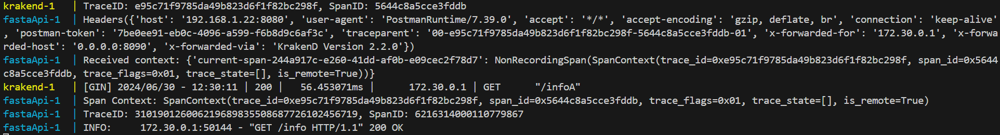

# Custom-Trace-Plugin-KrakenD
Create Custom Plugin in Go to generate Trace Context(server Kind) and forward it to a FastAPI application

****

**References :**
-  Generate Trace and Spand id in Go : https://opentelemetry.io/docs/instrumentation/go/getting-started/
- Create the first custom plugin for an request headers : https://www.eventslooped.com/posts/krakend-writing-plugins/
- Useful notes for  build such as building the plugin with the plugin-builder in Docker : https://www.krakend.io/docs/extending/writing-plugins/#plugin-builder
- Inject Go plugin into the KrakenD config : https://www.krakend.io/docs/extending/injecting-plugins/ ,https://www.krakend.io/docs/extending/http-server-plugins/

****
Let's started :

- ### Create custom Plugin in GO 
	First of all, there are 3 types of plugins ( for more information : https://www.krakend.io/docs/extending/ ), so we decited to create a HTTP Server Plugin( Handler plugin ) to modify the headers of each request when one of them hits the KrakenD. With simple words, as soon as a request hits the Krakend will reconstruct/modify the headers before it hist the our back-end services.

	The Handler plugin located on the Router Pipe as you can see in the picture below :

	

	Then inspired by 2 documents :
	- Generate Trace and Span ids in go : https://opentelemetry.io/docs/instrumentation/go/getting-started/
	- Create custom plugin : https://www.eventslooped.com/posts/krakend-writing-plugins/
	
	We created the final Go script that using for KrakenD Plugin :

    ```go
    package main

    import (
        "context"
        "fmt"
        "net/http"

        "go.opentelemetry.io/otel"
        "go.opentelemetry.io/otel/propagation"
        "go.opentelemetry.io/otel/sdk/trace"
        otelTrace "go.opentelemetry.io/otel/trace"
    )

    // Initialization function to indicate the plugin is loaded
    func init() {
        fmt.Println("TraceSpanGenerator plugin is loaded!")
    }

    func main() {}

    // HandlerRegisterer is a global variable to register handlers
    var HandlerRegisterer registrable = registrable("TraceSpanGenerator")

    // registrable is a custom type used for handler registration
    type registrable string

    const (
        pluginName  = "TraceSpanGenerator"
        nameTracer  = "Gateway-API"
    )

    // RegisterHandlers registers the HTTP handlers with tracing
    func (req registrable) RegisterHandlers(f func(
        name string,
        handler func(
            context.Context,
            map[string]interface{},
            http.Handler) (http.Handler, error),
    )) {
        f(pluginName, req.registerHandlers)
    }

    // newTraceProvider initializes and returns a new trace provider
    func newTraceProvider() (*trace.TracerProvider, error) {
        traceProvider := trace.NewTracerProvider()
        return traceProvider, nil
    }

    // Global tracer instance
    var tracer = otel.Tracer(nameTracer)

    // registerHandlers wraps the HTTP handler with tracing functionality
    func (req registrable) registerHandlers(ctx context.Context, extra map[string]interface{}, handler http.Handler) (http.Handler, error) {

        // Get the TextMapPropagator instance from the OpenTelemetry SDK
        propagator := propagation.TraceContext{}

        // Set the global propagator
        otel.SetTextMapPropagator(propagator)

        // Set up trace provider
        tracerProvider, err := newTraceProvider()
        if err != nil {
            fmt.Println("Error setting up trace provider:", err)
            return nil, err
        }

        otel.SetTracerProvider(tracerProvider)

        return http.HandlerFunc(func(w http.ResponseWriter, req *http.Request) {
            // Start a new span for the incoming request with root kind
            newCtx, span := tracer.Start(
                ctx,
                "Root-Server-Span",
                otelTrace.WithSpanKind(otelTrace.SpanKindServer),
            )
            defer span.End() // Ensure the span is ended

            // Log the current trace and span IDs
            spanContext := span.SpanContext()
            fmt.Printf("TraceID: %s, SpanID: %s\n", spanContext.TraceID(), spanContext.SpanID())

            // Inject the span context into the HTTP headers
            carrier := propagation.HeaderCarrier(req.Header)
            otel.GetTextMapPropagator().Inject(newCtx, carrier)

            // Call the next handler in the chain with the new context
            handler.ServeHTTP(w, req.WithContext(newCtx))
        }), nil
    }
    ```

- ### Create Docker file for our image with 2 stages :
	- one layer with : FROM golang:1.19.5-alpine3.17 as builder
	- second layer with : FROM devopsfaith/krakend:2.2.0

	We find the version which is compatible with KrakenD:2.2.0 with follow command :
	```
	docker run -it devopsfaith/krakend:2.2 version
	```

	Final Dockerfile  :

    ```dockerfile
    FROM golang:1.19.5-alpine3.17 as builder

    COPY ./krakend.json /app/krakend/krakend.json
    COPY ./go.mod /app/krakend/plugins/go.mod

    COPY ./*.go /app/krakend/plugins/

    WORKDIR /app/krakend/plugins
    # Initialize the Go module and download dependencies
    RUN go mod tidy

    # for alpine image
    # https://stackoverflow.com/questions/43580131/exec-gcc-executable-file-not-found-in-path-when-trying-go-build
    RUN apk add build-base

    # ChatGPT - build .so file to docker in macos with amd64 
    RUN CGO_ENABLED=1 GOOS=linux GOARCH=amd64 go build -buildmode=plugin -o headerModPlugin1.so headerModPlugin1.go

    FROM devopsfaith/krakend:2.2.0

    COPY --from=builder /app/krakend/krakend.json /etc/krakend/krakend.json
    COPY --from=builder /app/krakend/plugins/*.so /etc/krakend/plugins/
    ```


- ### Inject .so plugin into KrakenD Config

	References :
	 -  https://www.krakend.io/docs/extending/injecting-plugins/

    Into field **host** of .json config insert your machine ip :
    ```json
                "backend": [
                {
                    "url_pattern": "/info",
                    "encoding": "no-op",
                    "method":"GET",
                    "host": [
                        "http://x.x.x.x:8080/"
                    ]
    ```

	Final KrakenD Config injecting the plugin :
    ```json
    {
        "version": 3,
        "workers": 1,
        "read_timeout": "1m0s",
        "write_timeout": "1m0s",
        "timeout": "2000ms",
        "server_name": "KrakenD",
        "plugin": {
            "pattern":".so",
            "folder": "./plugins/"
        },
        "extra_config": {
        "github_com/devopsfaith/krakend/transport/http/server/handler": {
            "name": "TraceSpanGenerator",
            "attachuserid": "rsc"
        }
        },
        "endpoints": [
            {
                "endpoint": "/healthA",
                "method": "GET",
                "input_headers": ["*"],
                "timeout": "1s",
                "extra_config":{
                    "security/cors":{
                        "allow_origins":["*"],
                        "allow_methods":[
                            "GET"
                        ],
                        "expose_headers":["*"],
                        "allow_headers":["*"]

                    }
                },
                "backend": [
                    {
                        "url_pattern": "/health",
                        "encoding": "no-op",
                        "method":"GET",
                        "host": [
                            "http://x.x.x.x:8080/"
                        ]
                        
                    }
                ]
            },
                    {
                "endpoint": "/infoA",
                "method": "GET",
                "input_headers": ["*"],
                "timeout": "1s",
                "extra_config":{
                    "security/cors":{
                        "allow_origins":["*"],
                        "allow_methods":[
                            "GET"
                        ],
                        "expose_headers":["*"],
                        "allow_headers":["*"]

                    }
                },
                "backend": [
                    {
                        "url_pattern": "/info",
                        "encoding": "no-op",
                        "method":"GET",
                        "host": [
                            "http://x.x.x.x:8080/"
                        ]
                        
                    }
                ]
            }
        ]
    }
    ```


- ### RUN the application :
	```bash
    docker compose build
    ```
	```bash
    docker compose up
    ```
    ### Open the postman and type:
    - http://0.0.0.0:8090/infoA

    ### Output logs from Krakend and fastAPI

    
